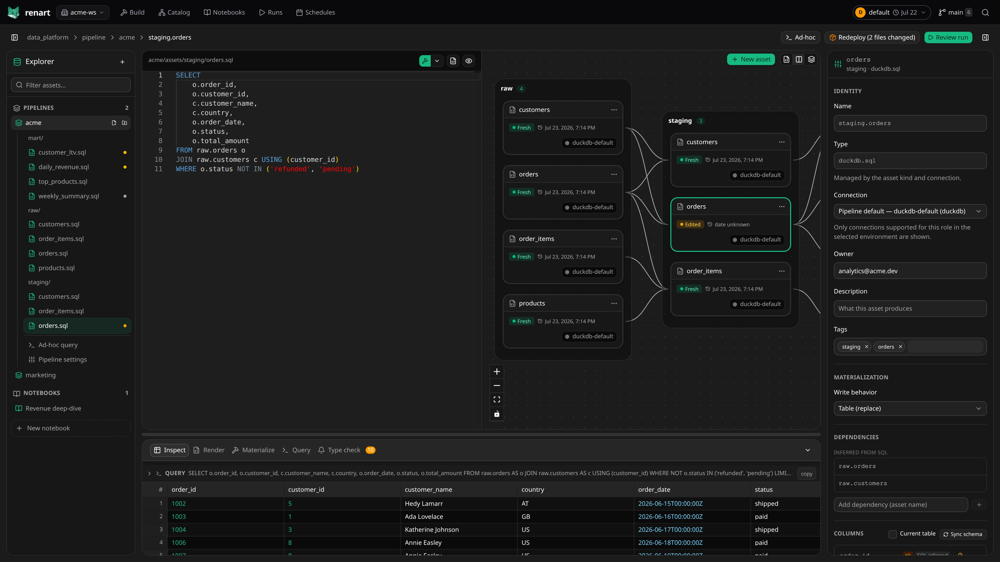

# Renart

Renart is an open-source, local-first IDE for building and running data pipelines
from a Git repository.

Build pipelines on a visual canvas, edit SQL and Python with pipeline-aware
IntelliSense, explore data in notebooks, and inspect or materialize assets from
one workspace. Renart runs on your machine and keeps your pipeline work as
plain, reviewable files.



## Highlights

- See assets, dependencies, lineage, and staleness on a visual pipeline canvas.
- Get schema-aware completion and validation while editing SQL.
- Inspect data safely before materializing an asset or building a pipeline.
- Explore data in notebooks and promote useful work into pipeline assets.
- Run and schedule pipelines per environment, with logs and history in the UI.
- Review every authored change as an ordinary Git diff.

## Install

```bash
curl -LsSf getrenart.com/install.sh | sh
```

Start Renart inside a Git repository:

```bash
renart web
```

Renart opens on `127.0.0.1:8080`. If that port is unavailable, it selects the
next free port and prints the URL.

## Documentation

- [Quickstart](https://getrenart.com/docs/quickstart/)
- [Full documentation](https://getrenart.com/docs/)
- [CLI reference](https://getrenart.com/docs/reference/cli/)

## License

Renart is licensed under the Apache License 2.0. See [`LICENSE`](LICENSE).
