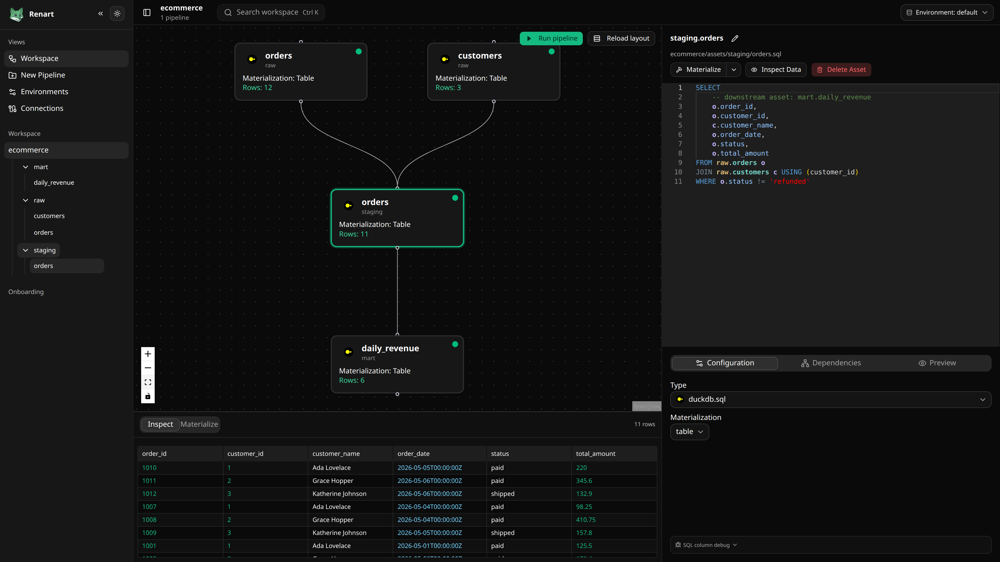

# Renart

Renart is the all-in-one data pipeline IDE — open source, and it runs entirely inside your Git repository.

Write SQL that knows your DAG, explore data in notebooks, preview and materialize assets, and put pipelines on a schedule — without standing up a hosted control plane, signing up for anything, or sending your data anywhere.



## What you get

- **A pipeline canvas.** See assets, dependencies, and lineage at a glance instead of reconstructing them from YAML and SQL by hand.
- **SQL that knows your pipeline.** The editor is grounded in your actual DAG: IntelliSense suggests columns from upstream assets and validation flags unresolved references while you type, so a broken column shows up in the editor, not in tomorrow's failed run.
- **Notebooks that graduate into pipelines.** Query your data ad hoc and see tables and charts inline. When a cell earns a permanent place, promote it into a real pipeline asset — same repo, same review flow.
- **Preview, then materialize.** Inspect any asset with no side effects, then materialize it explicitly when you're sure.
- **Schedules without an orchestrator.** Put a pipeline on a schedule per environment and Renart runs it against DuckDB, Postgres, Snowflake, BigQuery, Redshift, and more. Nothing separate to deploy and babysit.
- **Freshness you can see.** Renart fingerprints every asset — its code, its dependencies, its outputs — and shows what's fresh, stale, or missing on the canvas. Rerun what changed, skip what didn't.
- **Every change is a reviewable diff.** Moving a node, renaming an asset, or changing a materialization all land as plain file changes your team can branch, review, and revert like any other code.

## Who it's for

Renart is for data engineers, analytics engineers, and technical data users who want a fast visual way to build and understand pipelines without giving up version-controlled project files.

## Install

```bash
curl -LsSf getrenart.com/install.sh | sh
```

Then start Renart inside a Git repository:

```bash
renart web
```

Renart opens on `127.0.0.1:8080` by default. If that port is taken it picks the next free one and prints the URL. Everything it stores stays in your repository — no hosted service, no account, no data leaving your environment.

## Documentation

Full docs live at [getrenart.com](https://getrenart.com) and in `docs/`. To run them locally:

```bash
make docs-dev
```

## Development

Renart is a single Go binary with an embedded React frontend. It runs on the open-source [Bruin](https://github.com/bruin-data/bruin) execution engine and keeps everything on disk as plain, diffable files.

- **Backend:** Go HTTP server
- **Frontend:** React, TypeScript, Vite, TanStack Router, Tailwind CSS, Monaco, React Flow
- **Docs:** Astro + Starlight
- **Sync:** filesystem watcher plus Server-Sent Events

```bash
make help    # list targets
make build   # build the binary
make check   # run the checks
```

Contributing and architecture notes live in [`AGENTS.md`](AGENTS.md), with deeper current-state docs in [`architecture/`](architecture/) and in-flight design work in [`plans/`](plans/). Run `make check` before opening a PR.

## License

Renart is licensed under the Apache License 2.0. See [`LICENSE`](LICENSE).
